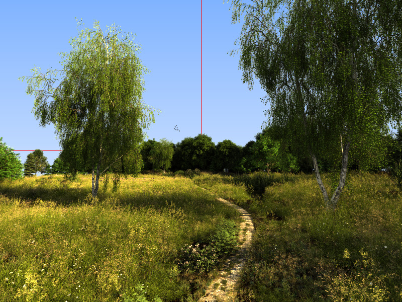
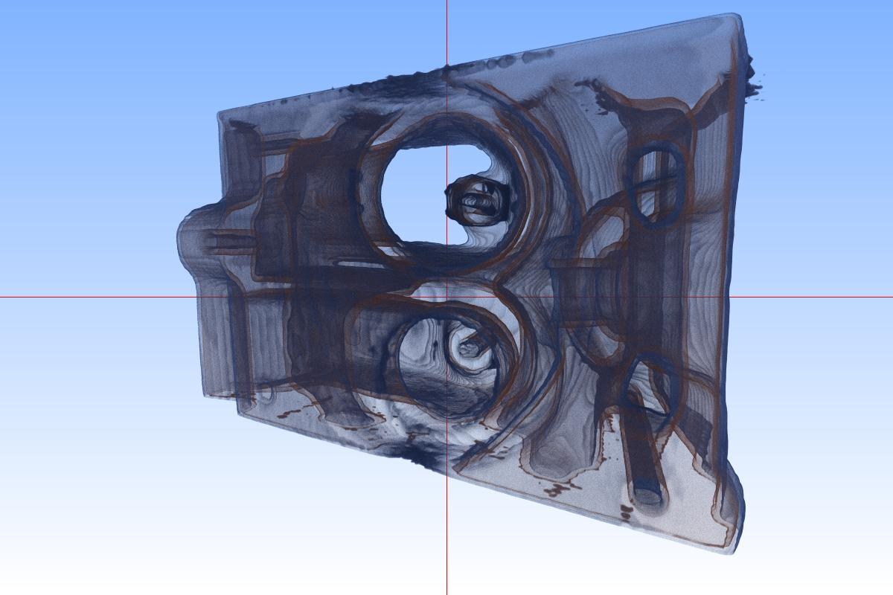
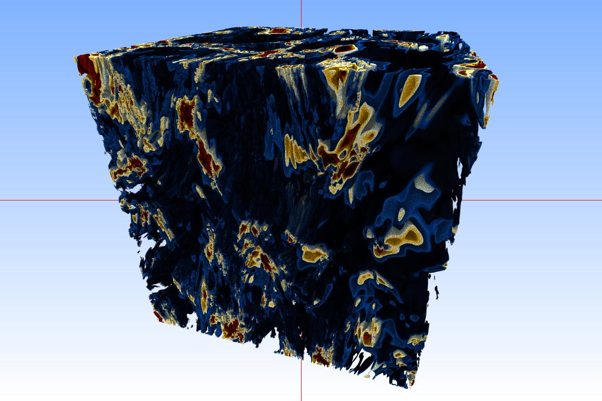

# Barney - A OptiX-CUDA Accelerated Path Tracer for Data-Parallel Sci-Vis Rendering

DISCLAIMER: Barney is a first prototype of a possibly-to-be data
parallel ray/path tracer for sci-vis content. It can actually do quite
a bit of "stuff" already; however, it is still experimental software.
In particular, `barney` is still *very much* "in flux": There are no
stable releases, nor are any of the feature-sets fully "spec'ed" or
even committed to; and any of the information in the remainder of this
document way well be outdated or even plain wrong by the time you are
going to read this. I will be happy about any feedback, bug reports,
reports about errors, broken documentation, etc, and will fix what I
can and who quickly I can - but do not expect this to be a finished
product in any way, shape, or form.

# Building and Running

Barney is not a stand-alone "renderer" or "vis-tool"; it is a library
with an API, and needs other applications to build towards it. As
such, it is never "run" on its own; it also needs to be run from another
application (e.g., `hayStack`, at http://github.org/ingowald/hayStack).

## Dependencies for building Barney

Barney requires the following additional tools and/or packages to build:

- `cmake`, for building

- `CUDA`, version 12 and up.

- `OWL` (https://github.com/owl-project/owl). Note OWL gets pulled in as a git
   submodule, no need to externally get and install.

- `OptiX`, as part of OWL. See documentation in OWL (https://github.com/owl-project/owl) for 
   where to get, and how to best install for OWL to easily find it)
   
- For data parallel multi-*node* rendering: MPI. *Running* barney
  requires a CUDA-aware MPI, for *building* this should not matter. We 
  typically develop under and test with OpenMPI 4.1.6.

## Building Barney

Barney is built via CMake. Eventually this is going to result in some
"installable" set of shadred library and header files; however, for
now (where it is still chaging very rapidly) the only truly
recommended way of building barney is as a git submodule, within the
application using it.

In that case, all the application should do is include in the parent app's `CMakeList.txt` as follows:

    add_subdirectory(<path to barney> EXCLUDE_FROM_ALL)
	
Barney's CMake scripts the use "modern cmake", so all include paths,
compile definitions, etc, will be pulled by 'linking' to the
respective 'barney` and `barney_mpi` targets:

- for single-node/multi-gpu (but possibly still multi-gpu
  data-parallel!) rendering, use:

        target_link_libraries(endUserApp PUBLIC barney)
	
- for MPI-parallel, multi-node (and possibly *also* multi-gpu) rendering, use: 
  data-parallel!) rendering, use:

        target_link_libraries(endUserApp PUBLIC barney_mpi)

The `barney_mpi` dependency will automatically pull in the cmake `MPI::MPI_CXX` dependency.

# Examples of Supported Geometry and Volume Types 

### Triangle Meshes (including Instances and Color- and Opacity Textures)

Example: PBRT landscape in `miniScene` (http://github.com/ingowald/miniScene) format:

Working:

- Image textures and texture coordinates are supported

- Alpha texturing for fully-transparent textures is supported (alpha
  channel, or dedicated alpha texture)

- Instancing is fully supported

Missing/incomplete:

- Material model is still very basic; reflection, refraction etc are not yet supported.

# Structured Volume Data

Structured Volume Data (`float`, `uint8` and `uint16` are supported,
and any volume can be distributed across different ranks by each rank
having different porions of that volume. `Barney` being intended for
sci-vis, every volume can have its own transfer function.

## Engine (`256x256x128_uint8`)

## 256GB Rot-strat (`4096x4096x4096_float`), data-parallel on 8x `RTX8000`

# ANARI / BARNARI

Though `barney` is not *limited to* ANARI (it is its own library, with
its own API), it can also be configured to build a (still every much
experimental!) `ANARI` "device" that exposes some of barney's
functionality. Once enabled in the cmake build, this builds a
`libanari_library_barney.so` that implemnets an ANARI device, and that
any ANARI-capable renderer can then load as the `"barney`" device.

Note: To distinguish between the (general) ANARI *API* and the
specific barney-based implementation of this API we typically refer to
this implementation as the `(B)ANARI` device, or simply as `banari`.

Disclaimer: if barney is still experimental, `banari` is even more so!
Not all `barney` functionality is exposed in `banari`, nor is every ANARI 
feature supported by `banari` - and even for the features that *are* supported, 
there may be some significant memory- or compute-overhead when going through this
device.

## Building BANARI:

- dependencies: `libgtk-3-dev`

- need to get, build, *and install* the ANARI-SDK:
  `git@github.com:KhronosGroup/ANARI-SDK`. Note the SDK *must*
  be installed for barney to properly find it.

- need to enable the `BARNEY_BUILD_ANARI` flag in barney's cmake
  config

- build `barney/anari` device in BARNEY build dir (not in haystack)

- add `barney/bin` dir (or whatever your build dir is called) to
  `LD_LIBRARY_PATH`, or link `libanari_library_baryney.so` into current dir

- `export ANARI_LIBRARY=barney`

