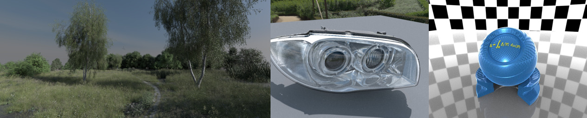
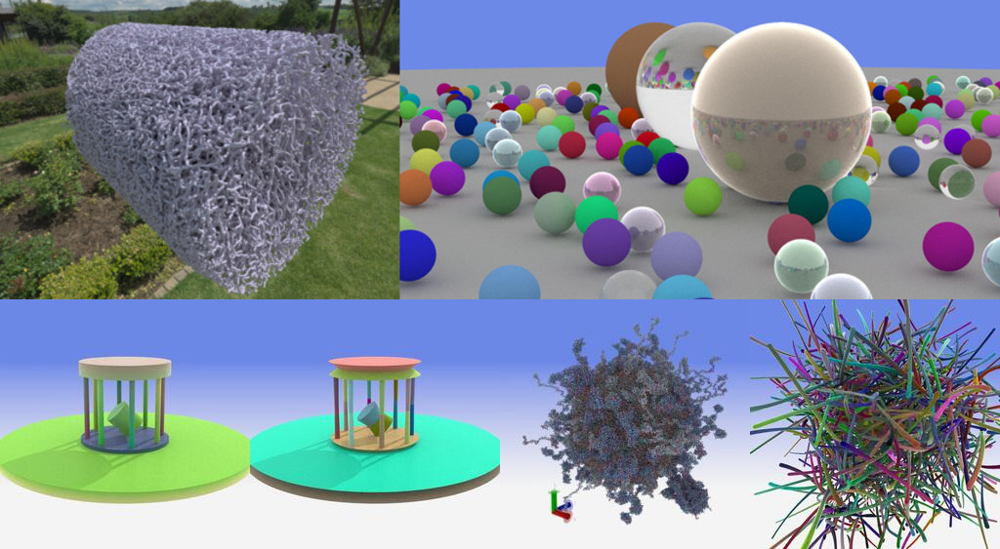
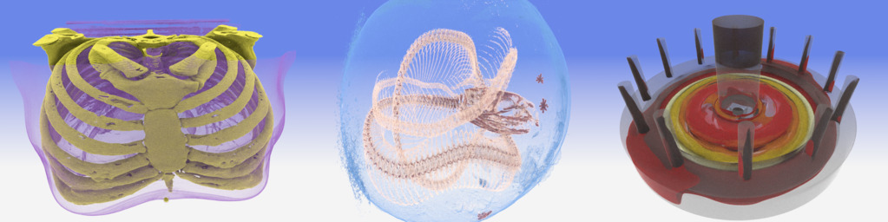

# Barney - A OptiX/CUDA Accelerated Path Tracer for High-Quality (and optionally Data-Parallel) Sci-Vis Rendering

DISCLAIMER: Barney is a first prototype of a possibly-to-be data
parallel ray/path tracer for sci-vis content. It can actually do quite
a bit of "stuff" already; however, it is still experimental software.
In particular, `barney` is still *very much* "in flux": There are no
stable releases, nor are any of the feature-sets fully "spec'ed" or
even committed to; and any of the information in the remainder of this
document way well be outdated or even plain wrong by the time you are
going to read this. I will be happy about any feedback, bug reports,
reports about errors, broken documentation, etc, and will fix what I
can and who quickly I can - but do not expect this to be a finished
product in any way, shape, or form.

# Building and Running

Barney is not a stand-alone "renderer" or "vis-tool"; it is a library
with an API, and needs other applications to build towards it. As
such, it is never "run" on its own; it also needs to be run from another
application (e.g., `hayStack`, at http://github.org/ingowald/hayStack),
or from any application that supports the ANARI API (see https://www.khronos.org/anari/).


## Dependencies for building Barney

Barney requires the following additional tools and/or packages to build:

- `cmake`, for building

- `CUDA`, version 12 and up.

- `OWL` (https://github.com/owl-project/owl). Note OWL gets pulled in as a git
   submodule, no need to externally get and install.

- `OptiX`, as part of OWL. See documentation in OWL (https://github.com/owl-project/owl) for 
   where to get, and how to best install for OWL to easily find it)
   
- For data parallel multi-*node* rendering: MPI. *Running* barney
  requires a CUDA-aware MPI, for *building* this should not matter. We 
  typically develop under and test with OpenMPI 4.1.6.

## Building Barney - no ANARI

Barney is built via CMake, using the cmake build/install procedure
that works on all of Linux, Windows, and Mac; but how to build it depends
on whether you want to build _just_ barney, or also (more likely) the
"Banari" ANARI device through which ANARI apps can use it.

## Building Barney - no ANARI

For native barney apps - ie, that do not want to use ANARI - you
can build without the ANARI SDK as follows:

``` bash
cd barney
mkdir build
cd build
cmake .. -DCMAKE_INSTALL_PREFIX=<same-install-dir-as-anari> [options]
cmake --build .. [ --config Release ]
cmake --install .. [ --config Release ]
```

Two notes for windows builds:

	- The "linux-like" calls to `cmake ...` etc will also work under windows, in
	both cmd.exe and powershell. You can of course also use the cmake and VS gui's, but you *will* have to then run the install target.
	
	- On windows you should specify the `--config Release` (or `Debug`, if you prefer) for both build and install; under Linux you can ignore this. For an ANARI build (see below) oyu want to use the same config as used for the ANARI SDK.

In the cmake config step, you may specify the following options:
   

- `-DOptiX_INSTALL_DIR=<path to optix>` . You can also set an env
  variable of the same name.

- `-DBARNEY_BACKEND_EMBREE=ON` Enables (slower) CPU rendering without
  a GPU. Off by deault

- `-DBARNEY_BACKEND_OPTIX=OFF` Optix is on by default, this will turn
  it off.

- `-DBARNEY_DISABLE_DENOISING=ON` Denoising is on by default (assuming
  a suitable denoiser can be found), this will turn it off

- `-DBARNEY_MPI=ON` Controls whether `barney_mpi` and
  `libanari_library_barney_mpi` will be build. Off by default,
  requires an appropriate (cuda aware!) MPI

## Building Barney - *with* ANARI

The ANARI build of barney works in pretty much the same way (and with
the same options), but requires a pre-built and installed `ANARI-SDK` from
https://github.com/KhronosGroup/ANARI-SDK. As to the time of this writing,
you need ANARI SDK version 0.13.2 (or `next_release` branch)

First, build and install the ANARI SDK:

``` bash
cd ANARI-SDK
mkdir build
cd build
cmake .. -DCMAKE_INSTALL_PREFIX=<install-dir>
cmake --build .. [ --config Release ]
cmake --install .. [ --config Release ]
```

Then, build barney as described above, using same install dir:
``` bash
cd barney
mkdir build
cd build
cmake .. -DCMAKE_INSTALL_PREFIX=<same-install-dir-as-anari> [options]
cmake --build .. [ --config Release ]
cmake --install .. [ --config Release ]
```

To install into a different install dir than ANARI (you probably shouldn't?):
``` bash
cd barney
mkdir build
cd build
cmake .. \
   -DCMAKE_INSTALL_PREFIX=<same-install-dir-as-anari> \
   -DCMAKE_PREFIX_PATH=<anari-install-dir>,<whatever-other_paths> \
   [options]
cmake --build .. [ --config Release ]
cmake --install .. [ --config Release ]
```

This accepts the same options as above. Note the command-line cmake build/install 
calls will also work on windows (though of course you can also use cmake-gui
and visual studio gui if you prefer so).


# Examples of Supported Geometry and Volume Types 

## Triangle Meshes (including Instances and Color- and Opacity Textures)

Example: PBRT landscape in `miniScene` (http://github.com/ingowald/miniScene) format, 
the 'embree headlight', and the TSDViewer 'TestORB'; all rendering
with HDRI env-map lighting.


## Non-Triangular Surface Types for Sci-Vis

Supporting most(all?) of the ANARI non-triangular geometry types: Here
various examples with capsules, spheres, cylinders, cones, and curves.



## Volume Data

Structured Volume Data (`float`, `uint8` and `uint16` are supported,
and any volume can be distributed across different ranks by each rank
having different porions of that volume. `Barney` being intended for
sci-vis, every volume can have its own transfer function.

Here examples 'chest' and 'kingsnake' (both regular structuctured
data, in different input scalar types), and on the right,
'scivis2011', a unstructured mesh volume type inside a
semi-transparent triangular surface.




# ANARI / BARNARI

Though `barney` is not *limited to* ANARI (it is its own library, with
its own API), it will also, by default build a (by now reasonably
complete!) `ANARI` "device" that exposes most of barney's
functionality to applications using the ANARI API. If enabled in the
cmake build (it's on by default)---and properly installed via `make
install` or `cmake --install`---this builds a implements an ANARI
device that any ANARI app can load as a ANARI device named
`"barney"`. If barney is built with MPI support for MPI-based
data-parallel ray tracing it will also build a ANARI `"barney_mpi"`
device as well. 

Note: To distinguish between the (general) ANARI *API* and the
specific barney-based implementation of this API we typically refer to
this implementation as the `(B)ANARI` device, or simply as `banari`.

## Building BANARI:

- dependencies: `libgtk-3-dev`

- need to get, build, *and install* the ANARI-SDK:
  `https://github.com/KhronosGroup/ANARI-SDK`. Note the SDK *must* be
  installed for barney to properly find it.

- build barney as described above. `BUILD_ANARI` should be on by
  default, so unless explictily disabled this should also build the
  banari device.

## Using BANARI:

The barney devices should be easily usably by any existing ANARI
application by simply loading the `"barney"` device. For those apps
that respect the `ANARI_LIBRARY` environment variable convention you
sohld also be able to just set `ANARI_LIBRARY=barney`, and have the
app load the `"default"` device. 

For data-parallel rendering across multiple collaborating ranks use
`"barney_mpi"`instead. Also see
https://www.google.com/url?sa=t&source=web&rct=j&opi=89978449&url=https://arxiv.org/abs/2407.00179&ved=2ahUKEwj2rPmKuqGMAxVLJUQIHVIvFSsQFnoECBoQAQ&usg=AOvVaw0z7wpXQQyZwSdPhd6effC8
for the conventions on how to properly use data-parallel ANARI (which
barney implements).

# Version History

## v0.9.2, 0.9.4, and 0.9.4: 

- various stability fixes and bug fixes in particular relating to
  materials, path tracing, and lighting, as well as on multi-device
  rendering
- closed various missing gaps wrt anari specs (missing formats,
  unsupported parameters, etc)

## v0.9.0

- major rework that allows 'rtcore' abstraction and multiple backends
- support both optix and embree (cpu only) backends
- completely reworked cmake build system (and in particular how stuff
  gets linked)
- reworked install/export/import system, exporting both `barney` and
  `barney_mpi`; should always get used through `find_package(barney)`
  and then linked as import target(s) `barney::barney` and (if found)
  `barney::barney_mpi`
- anari device split into `anari_library_barney` and
  `anari_library_barney_mpi`
- version used for pynari backend that works on all of
  linux/windows/mac and both cpu/gpu
  
Known limitations/issues:
- AMR support currently disabled
- umesh support only support cubql sampler

## v0.8.0

- updated to latest anari 0.12 SDK
- changed cuda arch detection to use 'native' by default, but allowing
  to override on cmdline.
- updated cuda arch detection in owl and cubql so as to allow barney
  to tell them which one to use (so it matches across all projects)
- reworked path tracing (and in particular MIS code) to (mostly-)pass
  a furnace test
